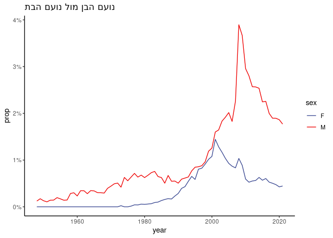

<!-- README.md is generated from README.Rmd. Please edit that file -->
# babynamesIL

<!-- badges: start -->
[](https://CRAN.R-project.org/package=babynamesIL) [](https://github.com/aviezerl/babynamesIL/actions/workflows/R-CMD-check.yaml) <!-- badges: end -->

The `babynamesIL` package provides a comprehensive dataset of names given to Israeli babies from 1948 to 2023. This data, sourced from the Israeli Central Bureau of Statistics (LAMAS), includes names used for at least 5 children in at least one gender and sector (Jewish, Muslim, Christian, Druze, and Other).

## Available Data

The package offers two main data objects:

-   `babynamesIL`: A dataset containing the number of babies given each name, categorized by year, sex, and sector from 1948 to 2023.
-   `babynamesIL_totals`: A summary dataframe with the total number of babies given each name, aggregated by sex and sector.

## Installation

``` r
# Install the released version from CRAN
install.packages("babynamesIL")

# Install the development version from GitHub
devtools::install_github("aviezerl/babynamesIL")
```

## Example

``` r
library(babynamesIL)

# yearly data
head(babynamesIL)
#> # A tibble: 6 × 6
#>   sector     year sex   name      n   prop
#>   <chr>     <dbl> <chr> <chr> <int>  <dbl>
#> 1 Christian  1948 F     לילה     19 0.129 
#> 2 Christian  1948 F     סמירה    14 0.0952
#> 3 Christian  1948 F     מארי     13 0.0884
#> 4 Christian  1948 F     נואל     11 0.0748
#> 5 Christian  1948 F     אמל       9 0.0612
#> 6 Christian  1948 F     מרים      7 0.0476
```

``` r

# totals per name
head(babynamesIL_totals)
#> # A tibble: 6 × 4
#>   sector    sex   name  total
#>   <chr>     <chr> <chr> <int>
#> 1 Christian F     מריה   1072
#> 2 Christian F     אמל     849
#> 3 Christian F     מרים    759
#> 4 Christian F     מארי    580
#> 5 Christian F     רים     555
#> 6 Christian F     מאיה    544
```

Add the missing values:

``` r
library(dplyr)
#> 
#> Attaching package: 'dplyr'
#> The following objects are masked from 'package:stats':
#> 
#>     filter, lag
#> The following objects are masked from 'package:base':
#> 
#>     intersect, setdiff, setequal, union
```

``` r
babynamesIL %>%
    tidyr::complete(sector, year, sex, name, fill = list(n = 0, prop = 0))
#> # A tibble: 3,275,600 × 6
#>    sector     year sex   name          n  prop
#>    <chr>     <dbl> <chr> <chr>     <int> <dbl>
#>  1 Christian  1948 F     'ג'ורג'       0     0
#>  2 Christian  1948 F     אאוס          0     0
#>  3 Christian  1948 F     אבא           0     0
#>  4 Christian  1948 F     אבגיל         0     0
#>  5 Christian  1948 F     אבטיסאם       0     0
#>  6 Christian  1948 F     אבי           0     0
#>  7 Christian  1948 F     אבי-אברהם     0     0
#>  8 Christian  1948 F     אביאור        0     0
#>  9 Christian  1948 F     אביאל         0     0
#> 10 Christian  1948 F     אביב          0     0
#> # ℹ 3,275,590 more rows
```

Plot trajectory of names:

``` r
library(ggplot2)
babynamesIL %>%
    tidyr::complete(sector, year, sex, name, fill = list(n = 0, prop = 0)) %>%
    filter(name == "מעיין", sector == "Jewish") %>%
    ggplot(aes(x = year, y = prop, color = sex)) +
    geom_line() +
    ggsci::scale_color_aaas() +
    scale_y_continuous(labels = scales::percent) +
    ggtitle("מעיין הבן מול מעיין הבת") +
    theme_classic()
```



## Data Sources

Data was downloaded from: [here](https://www.cbs.gov.il/he/publications/LochutTlushim/2020/%D7%A9%D7%9E%D7%95%D7%AA-%D7%A4%D7%A8%D7%98%D7%99%D7%99%D7%9D.xlsx).

2022 data was downloaded from: [here](https://www.cbs.gov.il/he/mediarelease/Pages/2023/%D7%94%D7%A9%D7%9E%D7%95%D7%AA-%D7%94%D7%A4%D7%A8%D7%98%D7%99%D7%99%D7%9D-%D7%A9%D7%A0%D7%99%D7%AA%D7%A0%D7%95-%D7%9C%D7%99%D7%9C%D7%99%D7%93%D7%99-2022.aspx)

2023 data was downloaded from: [here](https://www.cbs.gov.il/he/mediarelease/Pages/2024/%D7%94%D7%A9%D7%9E%D7%95%D7%AA-%D7%94%D7%A4%D7%A8%D7%98%D7%99%D7%99%D7%9D-%D7%A9%D7%A0%D7%99%D7%AA%D7%A0%D7%95-%D7%9C%D7%99%D7%9C%D7%99%D7%93%D7%99-2023.aspx)

## Web App

A web app using the data is available [here](http://babynames.lifshitz.xyz)
