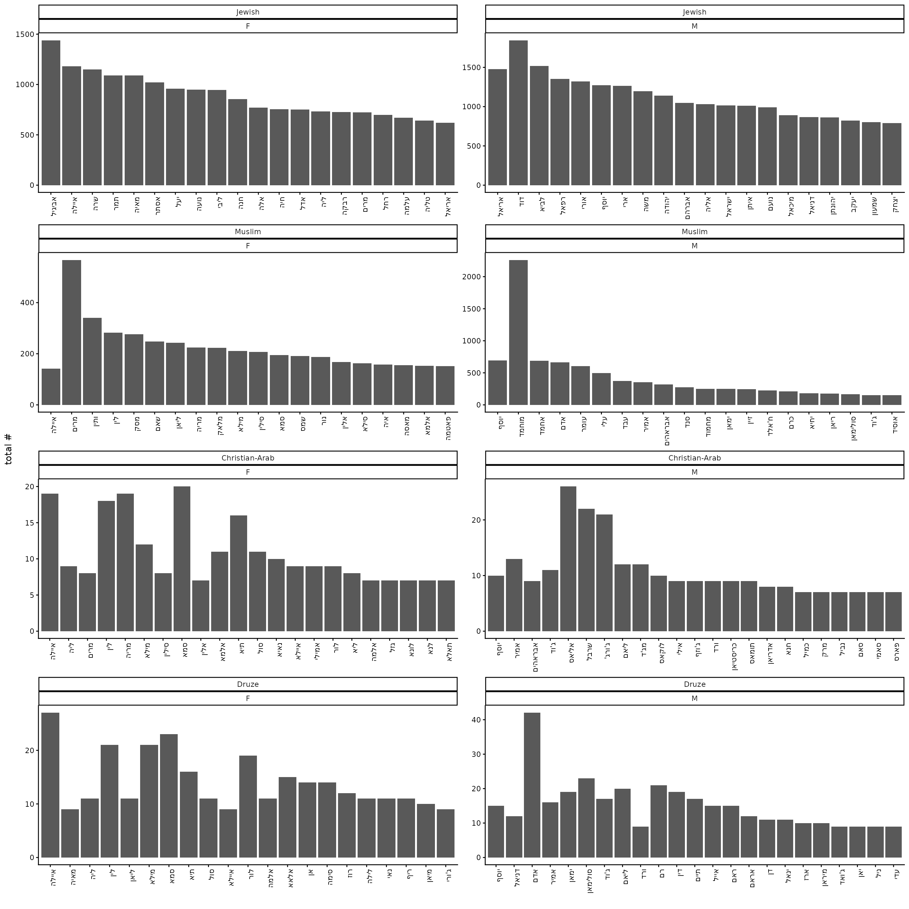
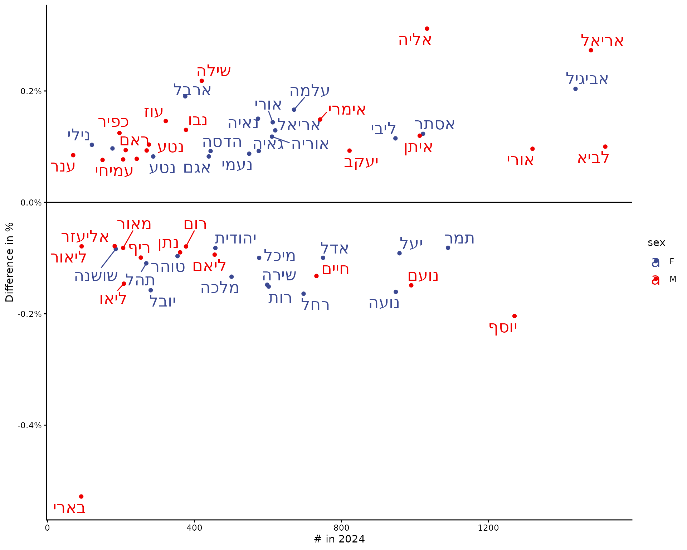
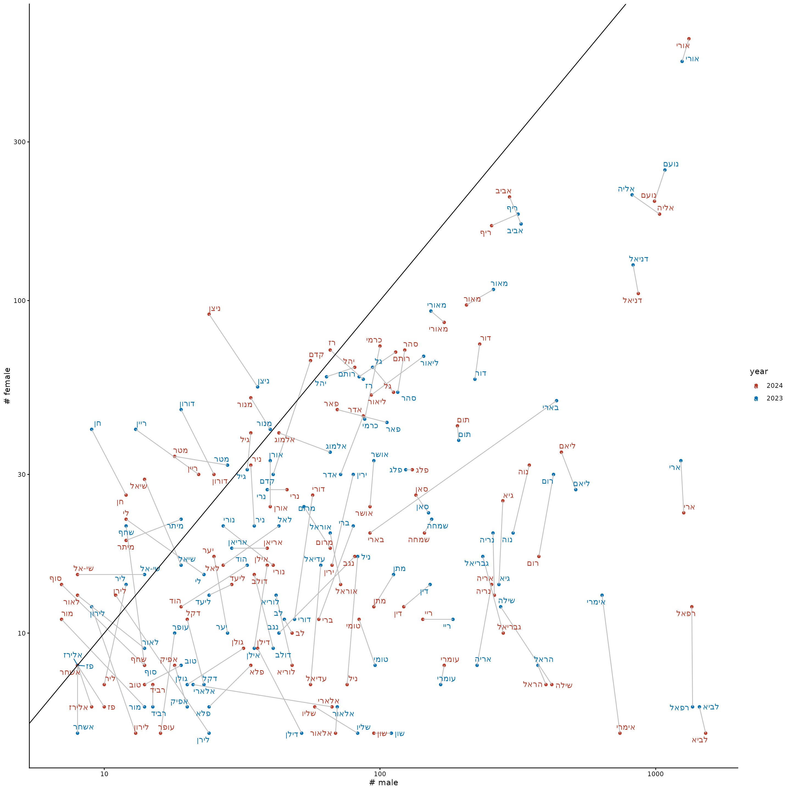
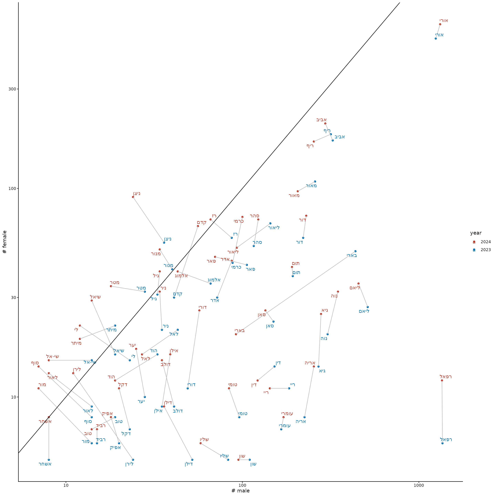
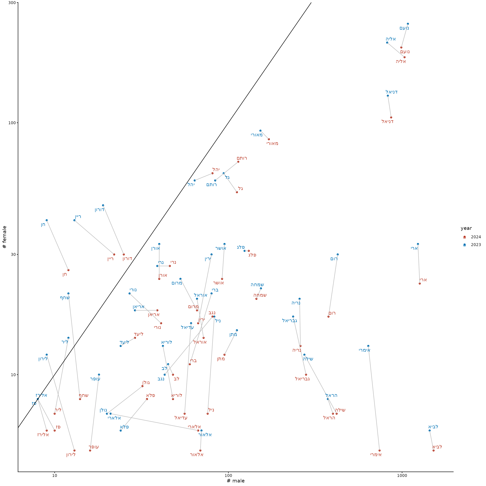

# 2024

``` r
library(babynamesIL)
library(tidyverse)
#> ── Attaching core tidyverse packages ──────────────────────── tidyverse 2.0.0 ──
#> ✔ dplyr     1.2.0     ✔ readr     2.2.0
#> ✔ forcats   1.0.1     ✔ stringr   1.6.0
#> ✔ ggplot2   4.0.2     ✔ tibble    3.3.1
#> ✔ lubridate 1.9.5     ✔ tidyr     1.3.2
#> ✔ purrr     1.2.1     
#> ── Conflicts ────────────────────────────────────────── tidyverse_conflicts() ──
#> ✖ dplyr::filter() masks stats::filter()
#> ✖ dplyr::lag()    masks stats::lag()
#> ℹ Use the conflicted package (<http://conflicted.r-lib.org/>) to force all conflicts to become errors
library(tgstat)
theme_set(theme_classic())
```

## 2024

### Top 10 names

``` r
babynamesIL %>%
    filter(year == 2024) %>%
    mutate(sector = factor(sector, levels = c("Jewish", "Muslim", "Christian-Arab", "Druze"))) %>%
    group_by(sector, sex) %>%
    slice_max(order_by = n, n = 20) %>%
    arrange(sector, sex, desc(n)) %>%
    mutate(name = forcats::fct_inorder(name)) %>%
    ggplot(aes(x = name, y = n)) +
    geom_col() +
    facet_wrap(sector ~ sex, scales = "free", ncol = 2) +
    ylab("total #") +
    xlab("") +
    theme(axis.text.x = element_text(angle = 90, hjust = 1))
```



### Names that changed the most in popularity

``` r
babynamesIL %>%
    filter(year %in% c(2024, 2023), sector == "Jewish") %>%
    pivot_wider(names_from = year, values_from = c(prop, n)) %>%
    filter(!is.na(prop_2024) & !is.na(prop_2023)) %>%
    mutate(prop_diff = prop_2024 - prop_2023) %>%
    arrange(sex, desc(abs(prop_diff))) %>%
    group_by(sex) %>%
    slice(1:30) %>%
    ggplot(aes(x = n_2024, y = prop_diff, color = sex, label = name)) +
    geom_point() +
    theme_classic() +
    ggsci::scale_color_aaas() +
    ggrepel::geom_text_repel(size = 6) +
    scale_y_continuous(label = scales::percent) +
    geom_hline(yintercept = 0) +
    ylab("Difference in %") +
    xlab("# in 2024")
```



### Names that shifted from ‘male’ to ‘female’ and vice versa

``` r
unisex_data <- babynamesIL %>%
    filter(sector == "Jewish", year %in% c(2023, 2024)) %>%
    pivot_wider(names_from = "sex", values_from = c("n", "prop"), values_fill = 0) %>%
    filter(n_M > 0 & n_F > 0) %>%
    mutate(ratio = n_M / n_F) %>%
    group_by(name) %>%
    filter(abs(ratio[1] - ratio[2]) >= 0.2) %>%
    ungroup()
unisex_data %>%
    ggplot(aes(x = n_M, y = n_F, label = name, color = factor(year, levels = c(2024, 2023)), group = name)) +
    geom_point() +
    ggsci::scale_color_nejm(name = "year") +
    geom_line(color = "gray") +
    scale_x_log10() +
    scale_y_log10() +
    ggrepel::geom_text_repel() +
    geom_abline() +
    xlab("# male") +
    ylab("# female")
```



Only names that became more male:

``` r
unisex_data %>%
    group_by(name) %>%
    filter(ratio[1] > ratio[2]) %>%
    ggplot(aes(x = n_M, y = n_F, label = name, color = factor(year, levels = c(2024, 2023)), group = name)) +
    geom_point() +
    ggsci::scale_color_nejm(name = "year") +
    geom_line(color = "gray") +
    scale_x_log10() +
    scale_y_log10() +
    ggrepel::geom_text_repel() +
    geom_abline() +
    xlab("# male") +
    ylab("# female")
```



Only names that became more female:

``` r
unisex_data %>%
    group_by(name) %>%
    filter(ratio[2] > ratio[1]) %>%
    ggplot(aes(x = n_M, y = n_F, label = name, color = factor(year, levels = c(2024, 2023)), group = name)) +
    geom_point() +
    ggsci::scale_color_nejm(name = "year") +
    geom_line(color = "gray") +
    scale_x_log10() +
    scale_y_log10() +
    ggrepel::geom_text_repel() +
    geom_abline() +
    xlab("# male") +
    ylab("# female")
```


