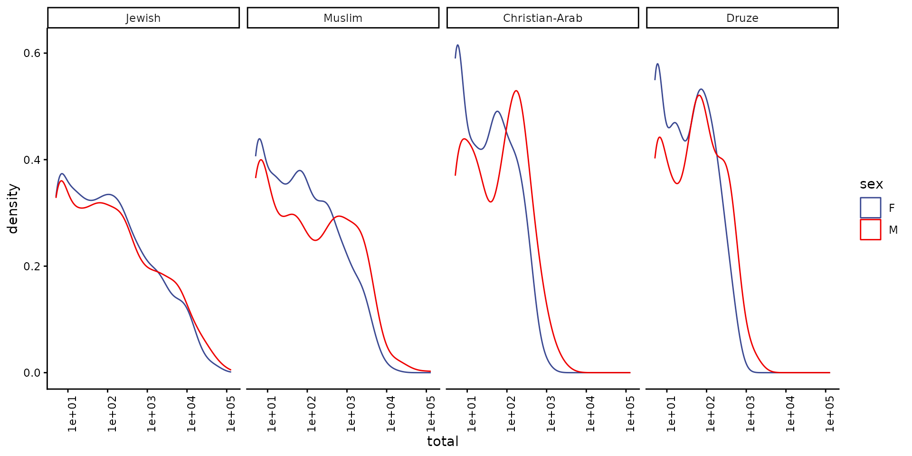
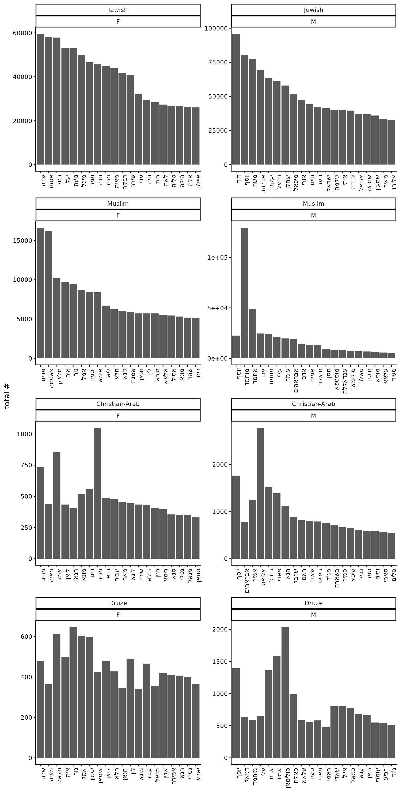
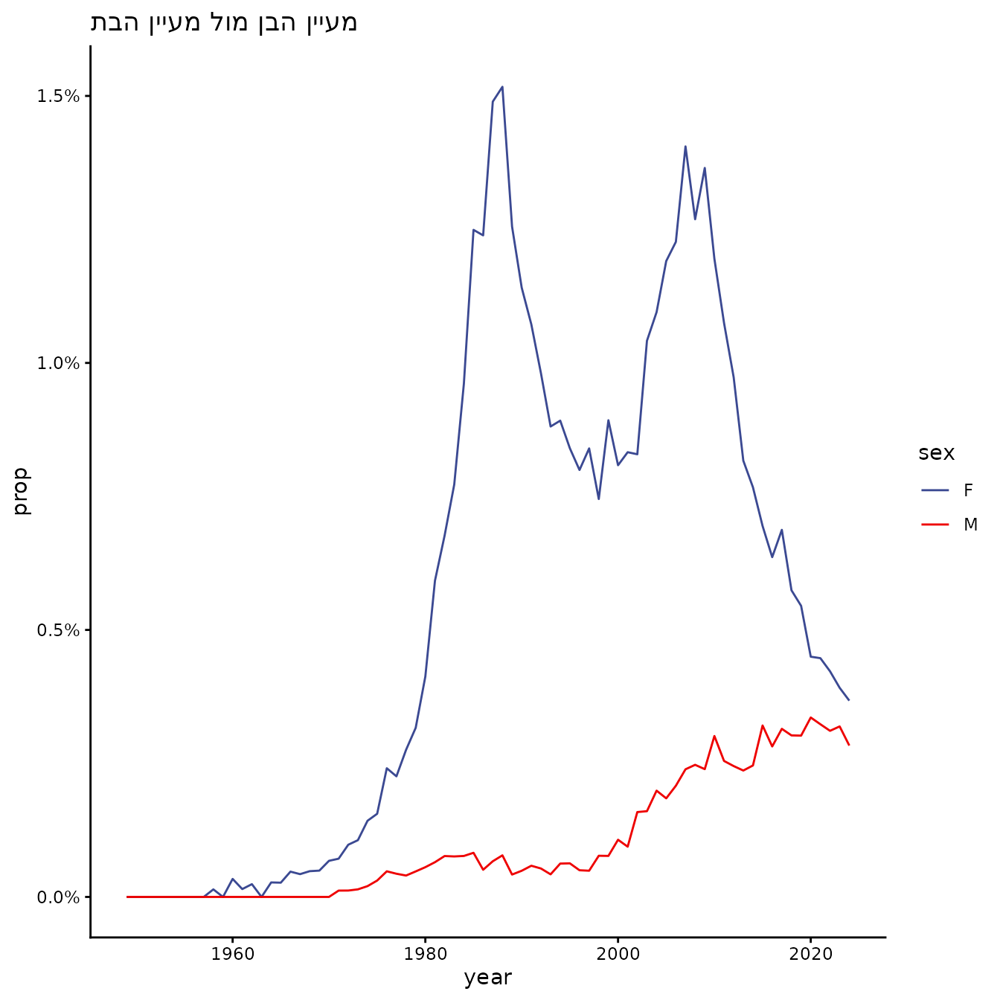
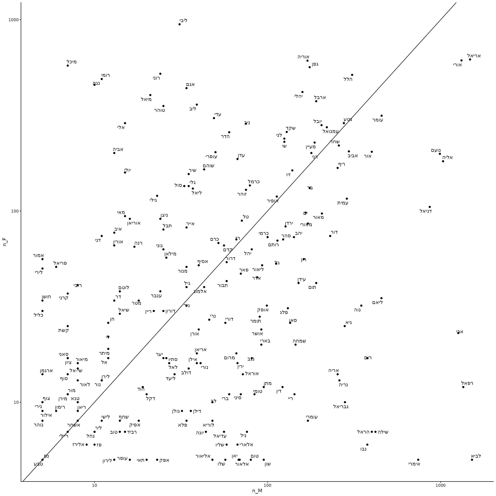
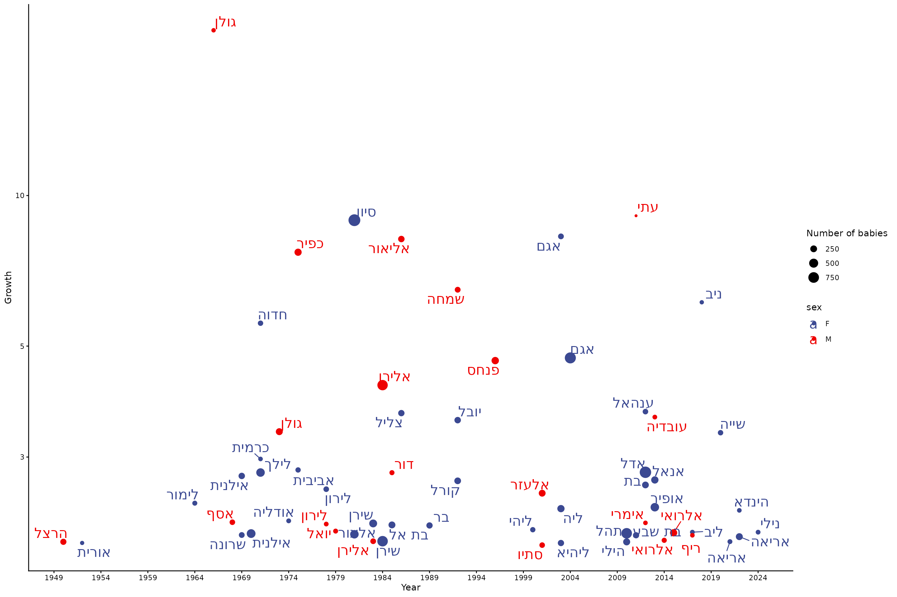
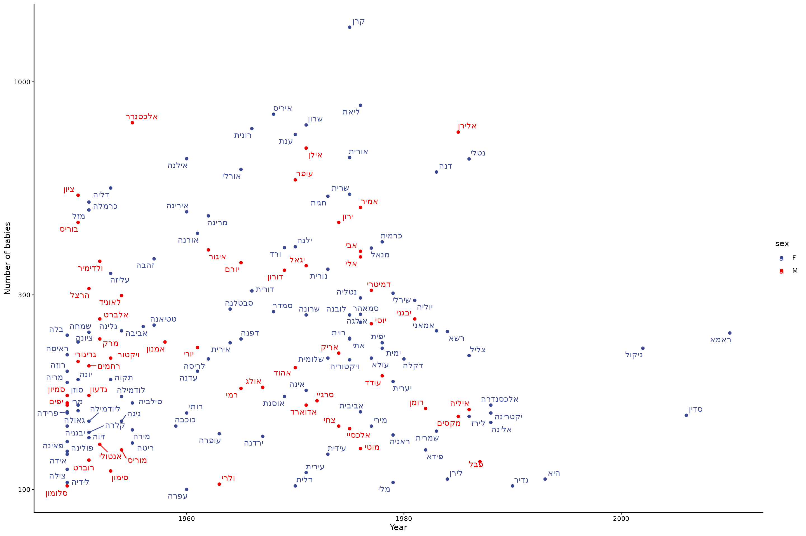

# Analysis

``` r
library(babynamesIL)
library(tidyverse)
#> ── Attaching core tidyverse packages ──────────────────────── tidyverse 2.0.0 ──
#> ✔ dplyr     1.2.0     ✔ readr     2.2.0
#> ✔ forcats   1.0.1     ✔ stringr   1.6.0
#> ✔ ggplot2   4.0.2     ✔ tibble    3.3.1
#> ✔ lubridate 1.9.5     ✔ tidyr     1.3.2
#> ✔ purrr     1.2.1     
#> ── Conflicts ────────────────────────────────────────── tidyverse_conflicts() ──
#> ✖ dplyr::filter() masks stats::filter()
#> ✖ dplyr::lag()    masks stats::lag()
#> ℹ Use the conflicted package (<http://conflicted.r-lib.org/>) to force all conflicts to become errors
library(tgstat)
theme_set(theme_classic())
```

## Israeli baby names

This package contains Israeli baby names data from 1949-2024, covering
four demographic sectors: Jewish, Muslim, Christian-Arab, and Druze.

### Distribution of names

We will start by looking at the distribution total number of babies for
each name:

``` r
babynamesIL_totals %>%
    mutate(sector = factor(sector, levels = c("Jewish", "Muslim", "Christian-Arab", "Druze"))) %>%
    ggplot(aes(x = total, color = sex)) +
    ggsci::scale_color_aaas() +
    geom_density() +
    scale_x_log10() +
    facet_grid(. ~ sector) +
    theme(axis.text.x = element_text(angle = 90, hjust = 1))
```



Note that the x axis is in log scale.

### Top names

Top 20 names in each sex and sector:

``` r
babynamesIL_totals %>%
    mutate(sector = factor(sector, levels = c("Jewish", "Muslim", "Christian-Arab", "Druze"))) %>%
    group_by(sector, sex) %>%
    slice_max(order_by = total, n = 20) %>%
    arrange(sector, sex, desc(total)) %>%
    mutate(name = forcats::fct_inorder(name)) %>%
    ggplot(aes(x = name, y = total)) +
    geom_col() +
    facet_wrap(sector ~ sex, scales = "free", ncol = 2) +
    ylab("total #") +
    xlab("") +
    theme(axis.text.x = element_text(angle = 90, hjust = 1))
```



### Names over time

#### a single name

``` r
babynamesIL %>%
    tidyr::complete(sector, year, sex, name, fill = list(n = 0, prop = 0)) %>%
    filter(name == "מעיין", sector == "Jewish") %>%
    ggplot(aes(x = year, y = prop, color = sex)) +
    geom_line() +
    ggsci::scale_color_aaas() +
    scale_y_continuous(labels = scales::percent) +
    ggtitle("מעיין הבן מול מעיין הבת") +
    theme_classic()
```



#### clustering

We will then create a matrix of the names and their frequencies over
time. We will start with Jewish female babies.

``` r
names_mat <- babynamesIL %>%
    filter(sector == "Jewish", sex == "F") %>%
    select(year, name, prop) %>%
    spread(year, prop, fill = 0) %>%
    column_to_rownames("name") %>%
    as.matrix()
dim(names_mat)
#> [1] 2302   76
```

Normalize each name:

``` r
mat_norm <- names_mat / rowSums(names_mat)
```

Select only names with at least 500 babies:

``` r
mat_norm_f <- mat_norm[babynamesIL_totals %>%
    filter(sector == "Jewish", sex == "F") %>%
    filter(total >= 500) %>%
    pull(name), ]
dim(mat_norm_f)
#> [1] 632  76
```

Cluster:

``` r
hc <- tgs_cor(t(mat_norm_f)) %>%
    tgs_dist() %>%
    hclust(method = "ward.D2")
```

Reorder the clustering by year:

``` r
hc <- as.hclust(reorder(
    as.dendrogram(hc),
    apply(mat_norm_f, 1, which.max),
    agglo.FUN = mean
))
```

Plot the matrix:

``` r
text_mat <- babynamesIL %>%
    filter(sector == "Jewish", sex == "F") %>%
    tidyr::complete(sector, year, sex, name, fill = list(n = 0)) %>%
    mutate(text = paste(name, paste0("year: ", year), paste0("n: ", n), sep = "\n")) %>%
    select(year, name, text) %>%
    spread(year, text) %>%
    column_to_rownames("name") %>%
    as.matrix()
plotly::plot_ly(z = mat_norm_f[hc$order, ], y = rownames(mat_norm_f)[hc$order], x = colnames(mat_norm_f), type = "heatmap", colors = colorRampPalette(c("white", "blue", "red", "yellow"))(1000), hoverinfo = "text", text = text_mat[hc$order, ]) %>%
    plotly::layout(yaxis = list(title = ""), xaxis = list(title = "Year"))
```

We will wrap it all in a function:

``` r
cluster_names <- function(sector, sex, min_total = 500, colors = colorRampPalette(c
                          ("white", "blue", "red", "yellow"))(1000)) {
    names_mat <- babynamesIL %>%
        filter(sector == !!sector, sex == !!sex) %>%
        select(year, name, prop) %>%
        spread(year, prop, fill = 0) %>%
        column_to_rownames("name") %>%
        as.matrix()
    text_mat <- babynamesIL %>%
        filter(sector == !!sector, sex == !!sex) %>%
        tidyr::complete(sector, year, sex, name, fill = list(n = 0)) %>%
        mutate(text = paste(name, paste0("year: ", year), paste0("n: ", n), sep = "\n")) %>%
        select(year, name, text) %>%
        spread(year, text) %>%
        column_to_rownames("name") %>%
        as.matrix()
    mat_norm <- names_mat / rowSums(names_mat)
    mat_norm_f <- mat_norm[babynamesIL_totals %>%
        filter(sector == !!sector, sex == !!sex) %>%
        filter(total >= min_total) %>%
        pull(name), ]
    text_mat <- text_mat[rownames(mat_norm_f), colnames(mat_norm_f)]
    hc <- tgs_cor(t(mat_norm_f)) %>%
        tgs_dist() %>%
        hclust(method = "ward.D2")
    hc <- as.hclust(reorder(
        as.dendrogram(hc),
        apply(mat_norm_f, 1, which.max),
        agglo.FUN = mean
    ))
    plotly::plot_ly(z = mat_norm_f[hc$order, ], y = rownames(mat_norm_f)[hc$order], x = colnames(mat_norm_f), type = "heatmap", colors = colors, hoverinfo = "text", text = text_mat[hc$order, ]) %>%
        plotly::layout(yaxis = list(title = ""), xaxis = list(title = "Year"))
}
```

We can now plot also the Male names:

``` r
cluster_names("Jewish", "M")
```

Or other sectors:

``` r
cluster_names("Muslim", "M")
```

``` r
cluster_names("Muslim", "F")
```

``` r
cluster_names("Christian-Arab", "M", 50)
```

``` r
cluster_names("Christian-Arab", "F", 50)
```

``` r
cluster_names("Druze", "M", 50)
```

``` r
cluster_names("Druze", "F", 50)
```

### Unisex names

We can plot names that are used for both male and female in a given
year, e.g. 2024:

``` r
babynamesIL %>%
    filter(sector == "Jewish", year == 2024) %>%
    pivot_wider(names_from = "sex", values_from = c("n", "prop"), values_fill = 0) %>%
    filter(n_M > 0 & n_F > 0) %>%
    ggplot(aes(x = n_M, y = n_F, label = name)) +
    geom_point() +
    scale_x_log10() +
    scale_y_log10() +
    ggrepel::geom_text_repel() +
    geom_abline()
```



Or we can use the matrices we created before to find patterns in the
ratio between male and female over time:

``` r
cluster_unisex_names <- function(sector, colors = colorRampPalette(c("blue", "white", "red"))(1000), epsilon = 1e-3) {
    mat_M <- babynamesIL %>%
        filter(sector == !!sector, sex == "M") %>%
        tidyr::complete(sector, year, sex, name, fill = list(n = 0, prop = 0)) %>%
        select(year, name, prop) %>%
        spread(year, prop, fill = 0) %>%
        column_to_rownames("name") %>%
        as.matrix()
    mat_F <- babynamesIL %>%
        filter(sector == !!sector, sex == "F") %>%
        tidyr::complete(sector, year, sex, name, fill = list(n = 0, prop = 0)) %>%
        select(year, name, prop) %>%
        spread(year, prop, fill = 0) %>%
        column_to_rownames("name") %>%
        as.matrix()
    uni_names <- intersect(rownames(mat_M), rownames(mat_F))
    ratio_mat <- log2(mat_M[uni_names, ] + epsilon) - log2(mat_F[uni_names, ] + epsilon)
    text_mat <- babynamesIL %>%
        filter(sector == !!sector) %>%
        tidyr::complete(sector, year, sex, name, fill = list(n = 0, prop = 0)) %>%
        pivot_wider(names_from = "sex", values_from = c("n", "prop"), values_fill = 0) %>%
        mutate(
            text =
                paste(name,
                    paste0("year: ", year),
                    paste0("# of male: ", n_M),
                    paste0("# of female: ", n_F),
                    paste0("% of male: ", scales::percent(prop_M)),
                    paste0("% of female: ", scales::percent(prop_F)),
                    sep = "\n"
                )
        ) %>%
        select(year, name, text) %>%
        spread(year, text) %>%
        column_to_rownames("name") %>%
        as.matrix()
    text_mat <- text_mat[rownames(ratio_mat), colnames(ratio_mat)]
    colors <- colorRampPalette(c("blue", "white", "red"))(1000)
    hc <- tgs_cor(t(ratio_mat)) %>%
        tgs_dist() %>%
        hclust(method = "ward.D2")
    hc <- as.hclust(reorder(
        as.dendrogram(hc),
        apply(ratio_mat, 1, which.max),
        agglo.FUN = mean
    ))
    n_names <- length(uni_names)
    plotly::plot_ly(z = ratio_mat[hc$order, ], y = rownames(ratio_mat)[hc$order], x = colnames(ratio_mat), type = "heatmap", colors = colors, hoverinfo = "text", text = text_mat[hc$order, ]) %>%
        plotly::layout(title = paste0(n_names, " unisex names from the ", sector, " sector"), yaxis = list(title = ""), xaxis = list(title = "Year"))
}
```

Run the function - red is more male names and blue is more female names:

``` r
cluster_unisex_names("Jewish")
```

``` r
cluster_unisex_names("Muslim")
```

``` r
cluster_unisex_names("Christian-Arab")
```

``` r
cluster_unisex_names("Druze")
```

### Names that are growing in a short period of time

We can look at names that are growing in popularity in a short period of
time, e.g. a single year.

``` r
growth_names <- babynamesIL %>%
    arrange(sector, sex, name, year) %>%
    filter(lead(n) >= 100) %>% # take only names with at least 100 babies
    group_by(sector, name, sex) %>%
    mutate(next_n = lead(n), growth = next_n / n) %>%
    ungroup() %>%
    filter(growth >= 2) %>%
    arrange(desc(growth))
head(growth_names)
#> # A tibble: 6 × 8
#>   sector  year sex   name      n     prop next_n growth
#>   <chr>  <dbl> <chr> <chr> <int>    <dbl>  <int>  <dbl>
#> 1 Jewish  1965 M     גולן      5 0.000144    107  21.4 
#> 2 Muslim  1974 M     וסאם     24 0.00262     359  15.0 
#> 3 Muslim  2008 F     גינא     22 0.00147     221  10.0 
#> 4 Jewish  2010 M     עתי       9 0.000143     82   9.11
#> 5 Jewish  1980 F     סיון    109 0.00256     973   8.93
#> 6 Jewish  2002 F     אגם      21 0.000435    174   8.29
nrow(growth_names)
#> [1] 118
```

Plot:

``` r
growth_names %>%
    filter(sector == "Jewish") %>%
    rename(`Number of babies` = next_n) %>%
    ggplot(aes(x = year + 1, y = growth, size = `Number of babies`, label = name, color = sex)) +
    geom_point() +
    theme_classic() +
    scale_y_log10() +
    ggsci::scale_color_aaas() +
    ggrepel::geom_text_repel(size = 6) +
    scale_x_continuous(breaks = seq(1949, 2024, 5)) +
    xlab("Year") +
    ylab("Growth")
```



### Declining names

We can look for names that declined the most:

``` r
decline_names_overall <- babynamesIL %>%
    arrange(sector, sex, name, year) %>%
    group_by(sector, name, sex) %>%
    summarise(max_n = max(n), min_n = min(n), max_year = year[which.max(n)], min_year = year[which.min(n)], decline = 1 - (min_n / max_n), .groups = "drop") %>%
    filter(max_n >= 100, max_year < min_year) %>%
    filter(decline >= 0.95)
decline_names_overall %>%
    arrange(max_n)
#> # A tibble: 159 × 8
#>    sector name   sex   max_n min_n max_year min_year decline
#>    <chr>  <chr>  <chr> <int> <int>    <dbl>    <dbl>   <dbl>
#>  1 Jewish עפרה   F       100     5     1960     1989   0.95 
#>  2 Jewish דלית   F       102     5     1970     1997   0.951
#>  3 Jewish סלומון M       102     5     1949     2003   0.951
#>  4 Muslim גדיר   F       102     5     1990     2013   0.951
#>  5 Jewish ולרי   M       103     5     1963     1998   0.951
#>  6 Jewish לידיה  F       104     5     1949     1995   0.952
#>  7 Jewish מלי    F       104     5     1979     2003   0.952
#>  8 Jewish לירן   F       106     5     1984     2023   0.953
#>  9 Muslim היא    F       106     5     1993     2014   0.953
#> 10 Jewish עירית  F       110     5     1971     1991   0.955
#> # ℹ 149 more rows
```

Plot:

``` r
decline_names_overall %>%
    ggplot(aes(x = max_year, y = max_n, label = name, color = sex)) +
    geom_point() +
    theme_classic() +
    ggsci::scale_color_aaas() +
    ggrepel::geom_text_repel() +
    xlab("Year") +
    scale_y_log10() +
    ylab("Number of babies")
```


